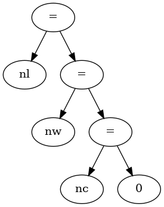
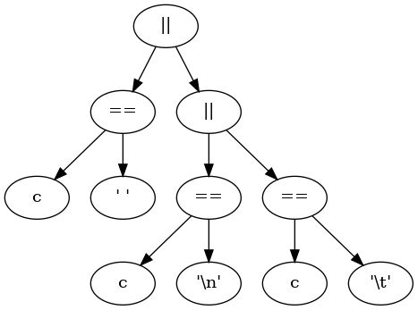
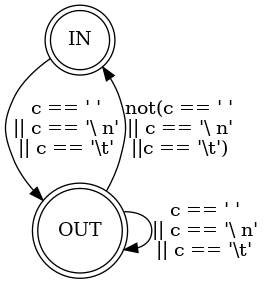

# Trabajo N° 5
### Githubuser: *FernandoLlallire*
### Legajo *1406693*
### Apellido: *Llallire*
### Nombre: *Fernando*
### Numero y título del trabajo: *Máquinas de Estado — Contador de Palabras*
### Curso: *K2051*
### Año de cursada: *2020*
#### Enunciado

1.Árboles de Expresión

a. Estudiar el programa del ejemplo las sección 1.5.4 Conteo de Palabrasde [KR1988].

b. Dibujar el árbol de expresión para la inicialización de los contadores: nl= nw = nc = 0.

c. Dibujar el árbol de expresión para la expresión de control del segundo if:c == ' ' || c == '\n' || c == '\t'.

2.Máquina de Estado:

a.Describir  en  lenguaje  dot    [DOT2015]  y  dentro  del  archivo  wc.gv  lamáquina de estado que resuelve el problema planteado.

b.Formalizar  la  máquina  de  estados  como  una  n-upla,  basarse  en  elCapítulo #1 del Volumen #3 de [MUCH2012].
## A = (Q, ∑, T, q0, F)

#### Q  = {IN, OUT}
#### ∑  = ASCII
#### q0 = OUT
#### F  = {IN, OUT}
#### T  =  {
#### IN => (c == ' '|| c == '\ n'|| c == '\t') => OUT,
#### OUT => (c == ' '|| c == '\ n'|| c == '\t') => OUT, 
#### OUT => NOT(c == ' '|| c == '\ n'|| c == '\t') => IN,
#### } 

3.Implementaciones de Máquinas de Estado:Las implementaciones varían en los conceptos que utilizan para representaarlos estados y las transiciones.

a. Implementación #1: Una variable para el estado actual.

i.Escribir el programa wc-1-enum-switch.c que siga la Implementación#1, variante enum y switch.Esta implementación es la regularización de la implementación de lasección 1.5.4 de [KR1988]. Los estados son valores de una variable ylas transiciones son la selección estructurada y la actualización de esavariable. Esta versión es menos eficiente que la versión de [KR1988],pero su regularidad permite la automatización de la construcción delprograma  que  implementa  la  máquina  de  estados.  Además  de  laregularidad, esta versión debe:
> Utilizar  typedef  y  enum  en  vez  de  define,  de  tal  modo  que  lavariable estado se pueda declarar de la siguiente manera: States = Out;
> 
> Utilizar switch en vez de if.36

ii.Responder en readme.md: Indicar ventajas y desventajas de la versiónde [KR1988] y de esta implementción.

**Como ventaja se puede ver que el codigo es mas parecido al de una maquina de estados en el caso del codigo con el switch/case lo cual ademas permite una cambios mas rapidos al querer agregar o sacar estados, dependiendo unicamente de la condicion para pasar al mismo.
Como desventaja esta el problema de posible codigo repetido en cada condicion ademas de que es un codigo mas largo a comparado con el del K&R**

**En cuanto al codigo de la implementacion n K&R como ventaja tenemos que el codigo es mas corto, pero como desventaja tenemos que el codigo no tiene similitud a una maquina de estados, como si lo tiene la implementacion anterior. Ademas de que puede haber problemas al usar el define y no el enum para poder controlar los estados posibles**

b. Implementación #2: Sentencias goto (sí, el infame goto)
> i.Leer la sección 3.8 Goto and labels de [KR1988]
> 
> ii.Leer Go To Statement Considered Harmful de [DIJ1968].
> 
> iii.Leer "GOTO Considered Harmful" Considered Harmful de [RUB1987].
> 
> iv. Responder en readme.md: ¿Tiene alguna aplicación go to hoy en día?¿Algún lenguaje moderno lo utiliza?
> 
> v.  Escribir el programa wc-2-goto.c que siga la Implementación #2.En esta implementación los estados son etiquetas y las transicionesson la selección estructurada y el salto incondicional con la sentenciagoto.

**Actualmente se usa mucho los labels del goto en asembler para poder hacer un salto a otras lineas de codigo, y como lenguaje actual en el que se puede ver un uso importante del mismo es en Golang, el cual es un lenguaje google.**

#### Hipótesis de trabajo que surgen luego de leer el enunciado.